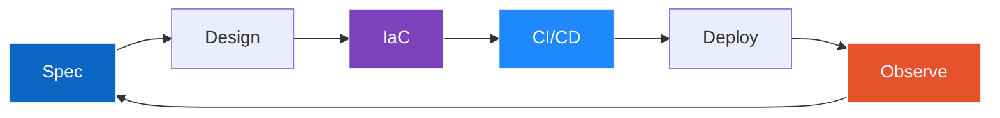

<!-- =============================================== -->
<!--  GITHUB PROFILE README — Wassim Daoudi Idrissi  -->
<!-- =============================================== -->

<h1 align="left">Wassim Daoudi Idrissi</h1>

  <em>DevOps &amp; Cloud Engineer · 42 Paris</em> 
  RNCP Level 7 — Expert in IT Architecture (Information Systems &amp; Networks)

  
  
  
  

---

### 🎯 Currently looking for

> **DevOps / Cloud Engineer apprenticeship** — Starting **September 7, 2026**  
> Rhythm: **2 weeks at company / 1 week at school** · Paris area (remote-friendly)

---

### 👋 About me

I design systems that are **reliable, automated, and reproducible**.  
Trained at 42 Paris through a project-based curriculum (algorithms, systems, networking, software development), I'm now focused on **DevOps and Cloud engineering**, with a strong interest in distributed systems and — on a longer horizon — scientific computing applied to quantitative finance.

- 🏗️ I build: containerized infrastructures, high-performance C++ servers, CI/CD pipelines
- 📚 I'm learning: Kubernetes, Terraform, GitOps with ArgoCD, observability (Prometheus/Grafana)
- 🌍 I speak: French (native), English (C2), Spanish (B2), Arabic

---

### 🛠️ Tech stack

**Languages**  

**DevOps & Cloud**  

**Systems & Web**  

**Currently learning**  

---

### 🚀 Featured projects

| Project | What it does | Stack |
|---------|--------------|-------|
| [**Inception**](https://github.com/Wdaoudi/inception_V2) | Private cloud infrastructure with Docker — Nginx + TLS, WordPress, MariaDB, fully reproducible | `Docker` `Nginx` `MariaDB` |
| [**ft_irc**](https://github.com/Wdaoudi/ft_irc) | Multi-client IRC server in C++ with epoll I/O multiplexing | `C++` `epoll` `TCP/IP` |
| **Webserv** | RFC-compliant HTTP/1.1 server in C++ — GET/POST/DELETE, CGI, multi-server config | `C++` `HTTP` `CGI` |
| **ft_transcendence** | Full-stack web app with real-time game, chat, and CI/CD | `React` `PostgreSQL` `GitHub Actions` |

---

### 🏗️ How I work

I ship systems that are **automated, reproducible, and observable** — not click-ops.

---

  Open to work — feel free to reach out via <a href="https://www.linkedin.com/in/wassim-daoudi-idrissi-7274b630a">LinkedIn</a> or <a href="mailto:wassim.daoudi75@gmail.com">email</a>.

